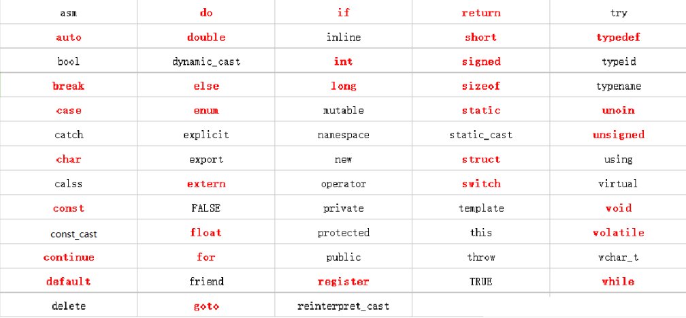

<center><span style="font-size:3rem;font-weight:bold;">C++学习笔记</span></center>

| 版本   | 时间       | 作者 | 备注         |
| ------ | ---------- | ---- | ------------ |
| V1.0.0 | 2022.05.22 | 吴魁 | 初始初始文件 |

<div style="page-break-after: always;"></div>

[toc]

<div style="page-break-after: always;"></div>

#  概述

三个阶段：

1. 基础入门（基本都是C语言基础，可以略过）

2. 面向对象
3. 泛型编程、STL使用

# C++基础语法入门

>  由于C++语言的基础语法是基于C语言，所有此部分只介绍与C语言不一样的部分。

## HelloWorld

```C++
#include <iostream>

using namespace std;

int main()
{
	cout << "hello world" << endl;

	system("pause"); //程序暂停，避免cmd窗口直接退出
	return 0;
}
```

## 基本输入输出

### I/O库：

**\<iostream>** : 该文件定义了 **cin、cout、cerr** 和 **clog** 对象，分别对应于标准输入流、标准输出流、非缓冲标准错误流和缓冲标准错误流。

### 标准输出流（cout）：

**endl** 用于在行末添加一个换行符

```c++
char str[] = "Hello C++";
cout << "Value of str is : " << str << endl;
```

### 标准输入流（cin）

```c++
char name[50];
cout << "请输入您的名称： ";
cin >> name;
cout << "您的名称是： " << name << endl;
```

### 标准错误流（cerr）

```C++
char str[] = "Unable to read....";
cerr << "Error message : " << str << endl;
```

### 标准日志流（clog）

```C++
char str[] = "Unable to read....";
clog << "Error message : " << str << endl;
```

## 关键字

下图中是**C++98/03中的63个关键字**，红色标注的是**C语言的32个关键字**。**C++11中有73个关键字**，新增加的10个分别为：alignas、alignof、char16_t、char32_t、constexpr、decltype、noexpect、nullptr、static_assert、thread_local



*（下面请添加首次遇到之前没见过的关键字）*

### new、delete

> 类比c语言的malloc、free

```c++
int *p = new int(10); 	//申请单个变量，并赋值
int *arr = new int[10]; //申请数组
delete p;
delete[] arr;			//释放数组 
```

## 数据类型

### 字符串类型

```C++
char str1[] = "hello world"; //C风格
string str2 = "hello world"; //C++风格 需要包含头文件 <string>
```

# C++核心编程

> 本阶段主要内容是C++面向对象编程

## 引用 

### 基本语法

作用：给变量起别名

语法：`数据类型 &别名 = 原民` 

```C++
int a = 10;
//int &b; 错误
int b = &a;
int c = 20;
//b = &c; 错误
```

注意事项：

1. 引用必须初始
2. 引用一旦初始化后，就不可以更改了

### 引用做函数参数 

作用：函数传参时，可以利用引用技术让形参修饰实参

优点：简化指针修改实参

```C++
void swap(int &a, int &b)
{
    int temp = a;
    a = b;
    b = temp;
}

int main()
{
    int a = 10;
    int b = 20;
    swap(a, b); //注意这里不用带取地址符号
    return 0;
}
```

### 引用做函数返回值

注意：

1. 不要返回局部变量的引用
2. 函数的调用可以作为左值

```C++
 int& test()
 {
     static int a = 10; //不能使用局部变量
     return a;
 }

int main()
{
    int &a = test(); 
    cout << "a = " << a << endl;
    test() = 1000; 	//作为左值
    cout << "a = " << a << endl;
    return 0;
}
```

### 常量引用

作用：常量引用主要用来修饰形参，防止形参改变实参误操作

```C++
void func(const int &val)
{
    cont << "val = " << val << endl;
}    
    
int main()
{
    //int &ref = 10  错误
    //加上const 编译器将代码修改为 =》 int temp = 10;const int &ref = temp
    const int &ref = 10;
    //ref = 20; //错误
    
    int a = 100;
    func(a);
    return 0;
}
```

### 引用的本质

> 引用的本质在C++内部实现是一个指针常量

```C++
int a = 10;
int& b = a; //自动转换为 int* const b = &a
b = 20;		//b为引用，自动转换为 *b = 20	
```

##   函数提高

### 默认参数

语法：`返回值类型 函数名 (参数 = 默认值) {}`

注意：

1. 如果某个位置参数有默认值，那么从这个位置后，必须都有默认值
2. 函数声明和函数实现不能都有默认参数，只能有一个

```c++
int func(int a, int b = 10, int c = 10){
	return a+b+c;
}

int main()
{
    func(11);
    func(11, 22);
    func(11, 22, 33);
    return 0;
}
```

### 函数占位参数

语法：`返回值类型 函数名 (数据类型) {}`

```c++
int func(int a, int){
	conu << "a = " << a << endl; 
}

//占位参数也能有默认参数
int func2(int a, int = 10){
	conu << "a = " << a << endl; 
}

int main()
{
	func(10, 20); //占位参数必须填补
    func2(10);
    return 0;
}
```

### 函数重载

函数重载满足条件：

* 同一个作用域下
* 函数名相同
* 函数的参数类型不同或者个数不同或者顺序不同

注意事项：

* 返回值不可以作为重载函数的条件
* 引用作为重载条件，注意带const和不带const，两个是可以区分的
* 函数重载碰到默认参数，出现二义性，尽量避免

```c++
int func(int a){
	conu << "int a" << endl; 
}

int func(int a, dobule b){
	conu << "int a, dobule b" << endl; 
}
int func(double b, int a){
	conu << "double b, int a" << endl; 
}

int main()
{
	func(10);
    func(10, 12.3);
    func(12.3, 10);
    return 0;
}
```

## 类和对象基本概念

> 具有相同性质的对象，我们可以抽象成为类，对象时类的实例化

### 封装

封装是C++面向对象三大特性之一

意义：

* 将属性和行为作为一个整体，表现一个事物
* 将属性和行为加以控制权限

用`class`来定义一个类:

语法：`calss 类名{ 访问权限： 属性 / 行为 };`

```C++
class Circle
{
public:
    //属性 成员变量
	int r;
    //行为 成员函数
    double calZC()
    {
        return 2 * 3.14 * r;
    }
};

int main()
{
    Circle c1;
    c1.r = 10;
    cout << "result = " << c1.calZC() << endl;
    return 0;
}
```

### 访问权限

| 访问权限  | 类内访问 | 类外访问 | 子类访问 |
| --------- | -------- | -------- | -------- |
| public    | 可以     | 可以     | 可以     |
| protected | 可以     | 不可以   | 可以     |
| private   | 可以     | 不可以   | 不可以   |

### struct和class的区别

唯一的区别在于默认的访问权限不同：

* struct 默认权限为公共
* class 默认权限为私有

```c++
class c1
{
    int a; //默认为私有权限
};

struct c2
{
    int a; //默认为公共权限
}


```

### 成员属性私有化

优点：

* 可以自己控制读写权限
* 可以检测数据有效性

```C++
class Preson
{
public:
    void set_name(string name){
        m_name = name;
    }
    
    string get_name(){
        return m_name;
    }
    
    void set_age(int age){
        if (age < 10 || age > 100)
        {
            cout << "age err" << endl;
        }
        
        m_age = age;
    }
    
private:
    string m_name;
    int m_age;
}
```

### 类分文件编写

 `.h`文件声明类：

```c++
#pragma once //避免重复加载
#include <iostream>
using namespace std;

class Preson
{
public:
    void set_name(string name)
    string get_name();    
    void set_age(int age);

private:
    string m_name;
    int m_age;
}
```

`.cpp`文件实现类函数：

```c++
#include <preson.h>

void Preson::set_name(string name)
{
    m_name = name;
}

string Preson::get_name()
{
    return m_name;
}
    
void Preson::set_age(int age)
{
    if (age < 10 || age > 100)
    {
        cout << "age err" << endl;
    }

    m_age = age;
}
```

## 对象的初始化和清理

### 构造函数和析构函数

特性：

* 编译器自动调用
* 如果不提供构造函数和析构函数，编译会提供空实现

构造函数语法：`类名(){}`

1. 没有返回值，也不写void
2. 函数名称与类名相同
3. 可以有参数，因此可以发生重载
4. 程序在调用对象时会自动调用构造，无需手动调用，且只调用一次

析构函数语法：`~类名(){}`

1. 没有返回值，也不写void
2. 函数名称与类名相同，在名称前面加上符号`~`
3. 不可以有参数，因此不可以发生重载
4. 程序在调用对象时会自动调用构造，无需手动调用，且只调用一次

```c++
class Preson
{
public:
    Preson()
    {
        cout << "Preson构造函数" << endl;
    }
    ~Preson()
    {
        cout << "Preson析构函数" << endl;
    }
};

void test()
{
    Preson p;
}

int main()
{
    test();
    return 0;
}
```

### 构造函数的分类及调用

两种分类方式：

* 按参数分为：有参构造和无参构造
* 按类型分为：普通构造和拷贝构造

三种调用方式：

* 括号调用
* 显式调用
* 隐式调用

```C++
class Preson
{
public:
    Preson()
    {
        cout << "Preson构造函数" << endl;
    }
    Preson(int a, int height = 20)
    {
        age = a;
        height = new int(height);
        cout << "Preson有参构造函数" << endl;
    }
    Preson(const Preson &p)
    {
        age = p.age;
        // height = p.height; //浅拷贝
        height = new int(*p.height); //深拷贝
        cout << "Preson拷贝构造函数" << endl;
    }
    ~Preson()
    {
        if (height != NULL)
        {
            delete height;
            height = NULL;
        }
        cout << "Preson析构函数" << endl;
    }
    
    int age; 
    int *height;
};

void test()
{
    //1.括号调用
    //Preson p1(); 不要加() 编译器会理解为函数声明
    Preson p1;
    Preson p2(10);
    Preson p3(p2);
    
    //2.显式调用
    Preson p4 = Preson(10);
    Preson p5 = Preson(p4);
    Preson(10); //匿名对象，当前执行结束后，系统立即回收
    //Preson(p5); 编译会认为Preson(p5) 等价于 Preson p5 会重定义错误
    
    //3.隐式调用
    Preson p4 = 10; // 等价于Preson p4 = Preson(10);
    Preson p4 = p5; // 等价于Preson p5 = Preson(p4);
}

//值传递的方式给函数参数传值时，会调用拷贝构造函数
void test1(Preson p)
{
    
}

//值方式返回局部对象，会调用拷贝构造函数
Preson test2()
{
    Preson p;
    return p;
}

int main()
{
    test();
    
    Preson p1;
    test1(p1);
    
    Preson p2 = test2();
    return 0;
}
```

### 构造函数调用规则

c++编译器至少给一个类添加3个函数

1. 默认构造函数（无参，函数体为空）
2. 默认析构函数（无参，函数体为空）
3. 默认拷贝构造函数，对属性进行值拷贝

调用规则：

* 如果定义有参构造函数，c++不提供默认无参构造，但会提供默认拷贝构造
* 如果定义拷贝构造函数，c++不会提供其他构造函数

### 初始化列表

语法： `构造函数():属性值1(值1),属性值2(值2)...{}`

```c++
class Preson
{
public:
    Preson(a, b, c):m_a(a), m_b(b),m_c(c){
        
    }
    
    int m_a;
    int m_b;
    int m_c;
}
```

类的对象作为另一个类的成员，成员先构造

### 静态成员

* 静态成员变量：
  * 所有对象都共享同一份数据
  * 编译阶段就分配内存
  * 类内声明，**类外初始化操作**
* 静态成员函数：
  * 所有对象都共享同一个函数
  * 静态成员函数只能访问静态成员变量

```C++
class Preson
{
public:
    static void func()
    {
        m_a = 100;
        //m_b = 200; 不能访问
    }
    
    static int m_a;
    int m_b;
}

int Preson::m_a = 100;

int main()
{
    Preson p;
    count << p.m_a << endl;
    p.func();
    
    //通过类名方式访问
    count << Preson::m_a << endl;
    Preson::func();
    
}
```

## C++对象模型和this指针

### this指针

 在C++中，类内的成员变量和成员函数分开存储，只有非静态成员变量才属于类的对象上

空对象占1个字节内存

每个非静态成员函数只会诞生一份实例，也就是说多个同类型的对象会公用一块代码

this指针指向被调用的成员函数所属的对象，是隐含每一个非静态成员函数内的一种指针，不需要定义，直接使用即可

用途：

* 当形参和成员变量同名时，可用this指针区分
* 在类的非静态成员函数中返回对象本事，可以用`return *this`

```c++
class Preson
{
public:
    Preson(int a)
    {
        //this指针指向 被调用的成员函数所属的对象
        this->a = a; //重名时使用
    }
    
    Preson& Add(Preson &p)
    {
        this->a += p.age;
        return *this;
    }
    
    int a;
}

int main()
{
    Preson p1(10);
    Preson p2(10);
    //链式编程
    p2.Add(p1).Add(p1).Add(p1)
}
```

# C++提高编程

## 模版

### 函数模版

### 类模版


# 其他

## 科学计数法

```C++
float a = 3e2; //3 * 10 ^ 2
float a = 3e-2; //3 * 0.1 ^ 2
```

